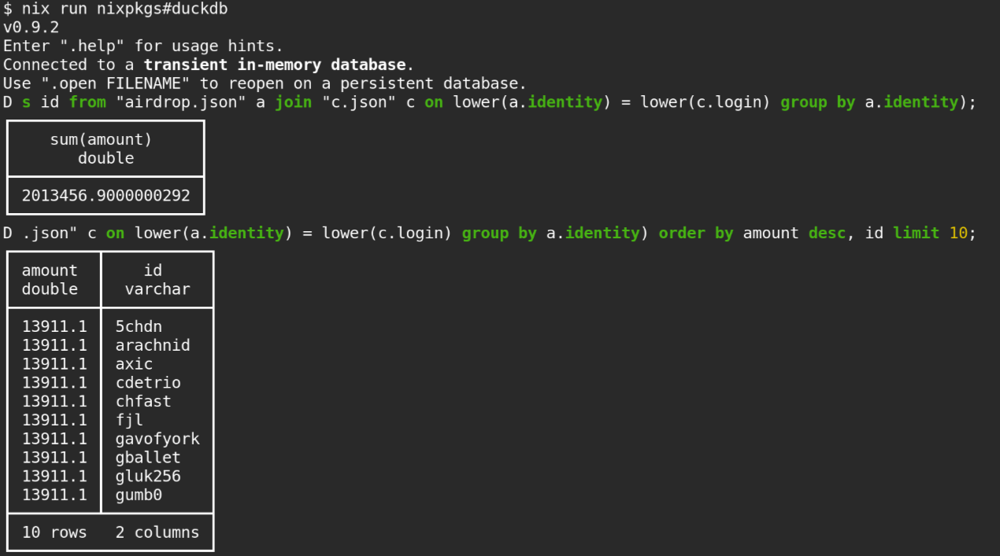

# Query the starknet airdrop amount by contributors to an organization or a repository

## Screenshot



## Download contributors data

To save contributors data of the apache organization to the apache folder, and the contributors data
of nixos/nixpkgs to the nixos/nixpkgs folder, run the following command

```
./get_contributors_for_org.sh -o apache -r nixos/nixpkgs -t TOKEN
```

where TOKEN must be a valid github access token (this is required in order to prevent being rate-limited).
This command will save all contributors information to the file `apache/contributors.json` and `nixos/nixpkgs/contributors.json`.
Note that this will take a while, it may never even finish as there are just too many repos and contributors
to [https://github.com/apache](https://github.com/apache). You may rerun the script a few times.
If any thing goes wrong, then just run the following command to save partial results.

```
jq -c '.[]' apache/*/contributors.*.json > apache/contributors.json
```
 
or

```
rm apache/contributors.json
for f in apache/*/contributors.*.json; do jq -c '.[]' "$f" >> apache/contributors.json; done
```
which is slower, but tolerates incomplete file downloads and can accept an unbounded number of files.

## Query airdrop amount with duckdb

The file [./airdrop.json](./airdrop.json) contains the data from [starknet-io/provisions-data](https://github.com/starknet-io/provisions-data/tree/23f9b866c127892f59ce1d1bc967d2f5be85b72a/github),
which has a list of all github users with the airdrop amount. We can easily query these data with [duckdb](https://duckdb.org/).
Below are some examples.

### Show who has an airdrop of more than 1000 STRK

```
select amount, identity from "airdrop.json" where amount > 10000 order by amount desc, identity;
```

### Show all airdrop amounts along with github id `apache/contributors.json`

```
select * from (select min(a.amount) as amount, a.identity as id from "airdrop.json" a join "apache/contributors.json" c on lower(a.identity) = lower(c.login) group by a.identity) order by amount desc, id limit 10;
```

### Show summed airdrop amounts for contributors in `apache/contributors.json`

```
select sum(amount) from (select min(a.amount) as amount, a.identity as id from "airdrop.json" a join "apache/contributors.json" c on lower(a.identity) = lower(c.login) group by a.identity);
```
